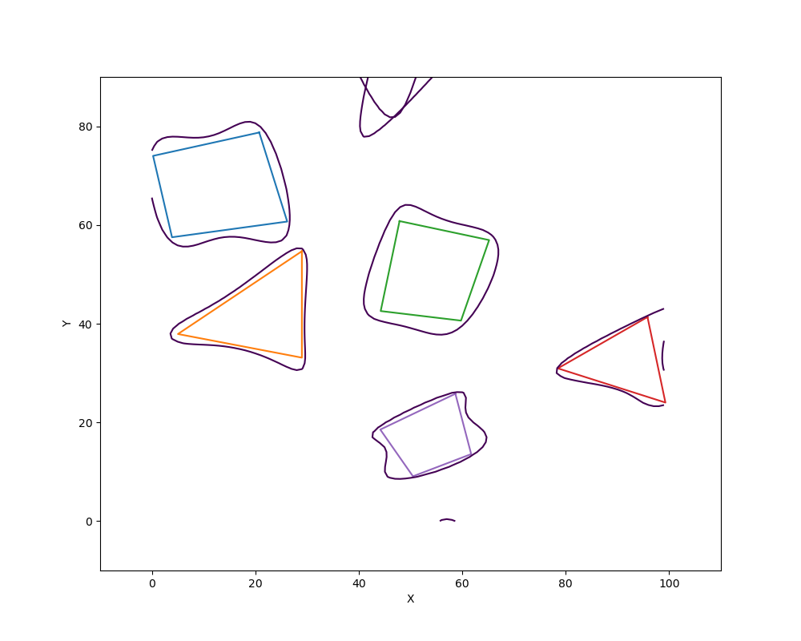

# CBF-RRTstar

+ Sampling equidistant n points on the map and labeled each point either free space or obstacle

  + obstacles points:

  ```python
  points1 = [[5, 71], [18, 74], [21, 64], [7, 62]]
  points2 = [[15, 40], [25, 47], [25, 38]]
  points3 = [[49, 46], [51, 56], [60, 54], [57, 45]]
  points4 = [[88, 32], [93, 35], [94, 30]]
  points5 = [[50, 17], [56, 20], [57, 16], [52, 14]]
  obs_list = [points1, points2, points3, points4, points5]
  ```

  + safe distance to create a buffer zone around obstacles: `sd = 4`

  + draw the grid map and obstacles: `draw_poly(obs_list, sd)`


+ Using logistic regression to construct polynomial barrier functions to represent complex obstacles
  + Somehow the functions in the existing package do not look good on the simulation result, so we write our own sigmoid, regularized loss function, and the gradient.
  + Constructing polynomial barrier function h(x) and draw the contour to represent the obstacles.
  + Problems & future work: 
    + If the obstacles are too small, then the obstacle/free space ratio is too small, causing the simulating of polygons being affected.
    + There are other points (mostly outside the map) that satisfy $$\beta z^T = 0$$ so as shown in the [figure](#image-anchor), there will be dots and lines other than just the obstacles.
    + Other problems such as local minima due to there may be indentation of some edges of the polygons.

<a name="image-anchor"></a>

