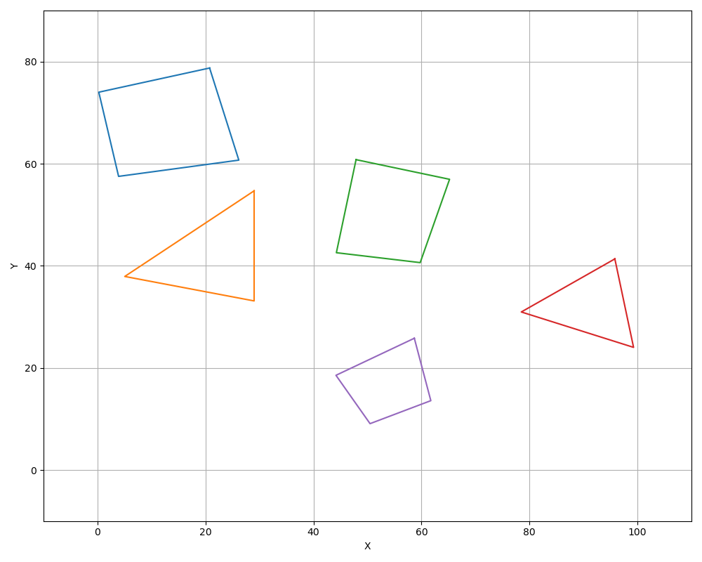
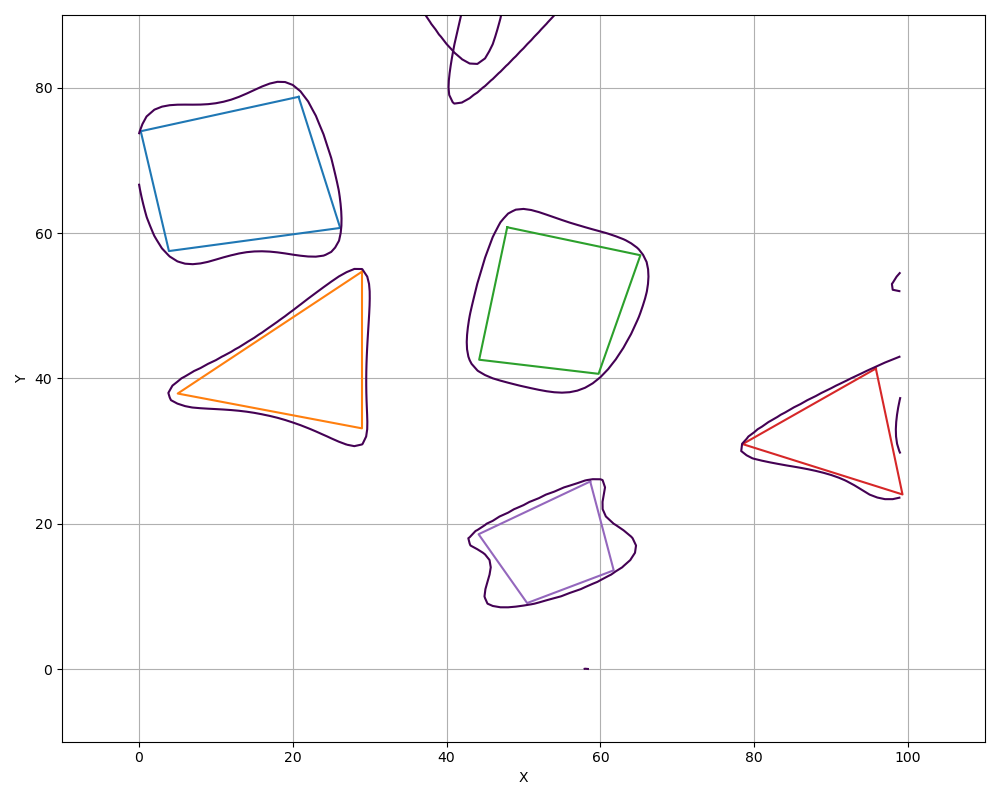
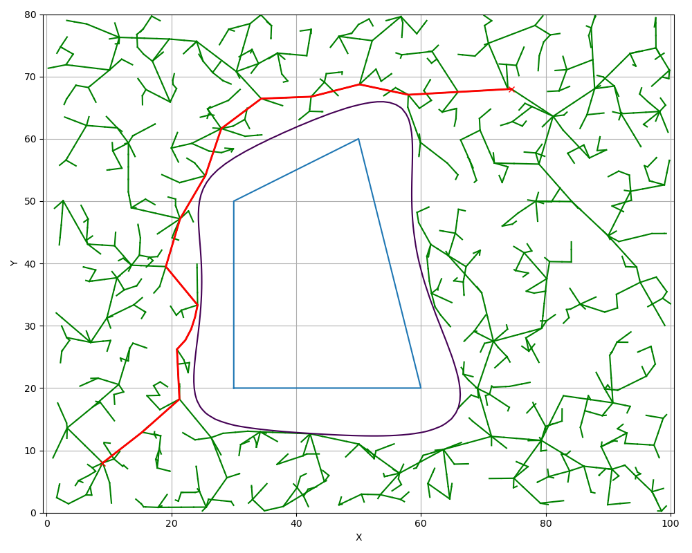
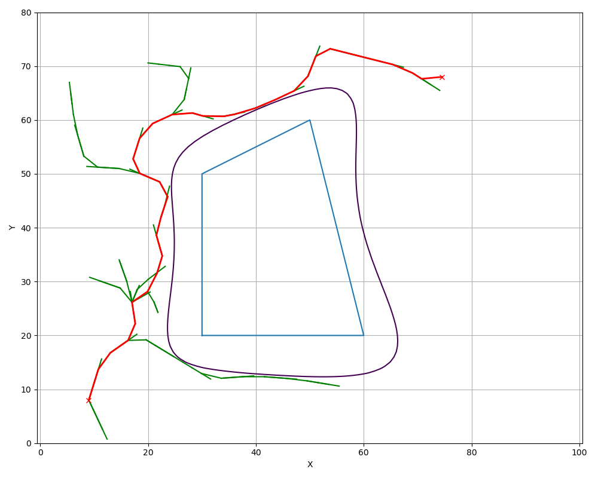
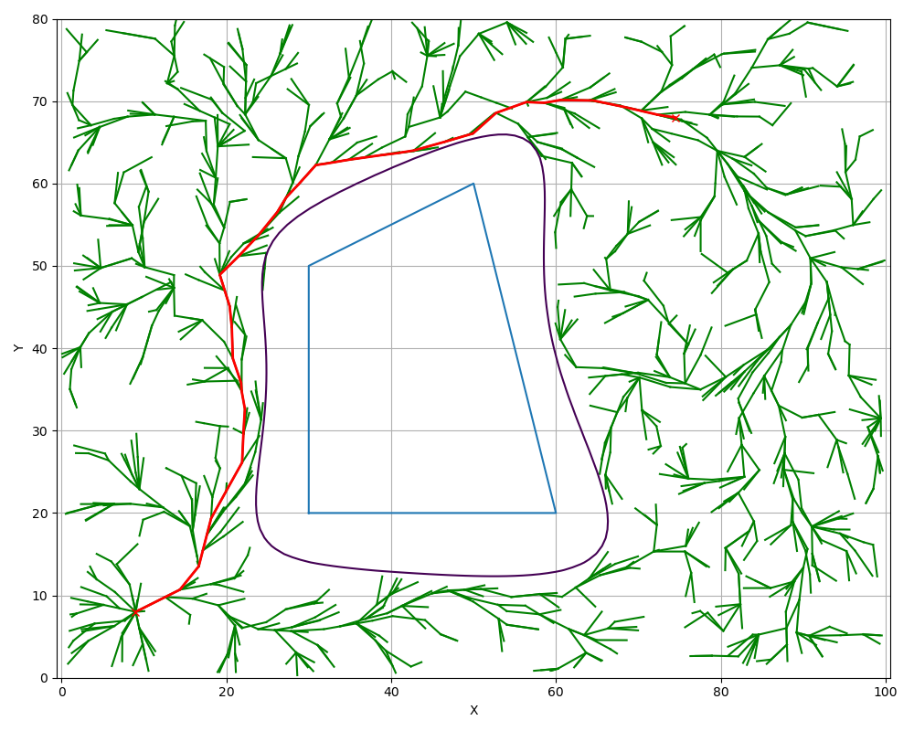

# CBF-RRTstar

This repository reproduces the method from [Safe Path Planning for Polynomial Shape Obstacles via Control Barrier Functions and Logistic Regression](https://arxiv.org/abs/2210.03704).

The paper combines three pieces:

1. Build polynomial barrier functions for polygon-shaped obstacles with logistic regression.
2. Use multi-step CBF steering for RRT/RRT* expansion.
3. Use RRT* `ChooseParent` and `Rewire` to improve path cost after nodes are added.

## Setup

```bash
conda env create -f requirements/environment.yml
conda activate cbf_rrtstar
```

or install with pip:

```bash
pip install -r requirements/requirements.txt
```

Run the demo:

```bash
python driver.py
```

Run regression tests:

```bash
pytest -q
```

Regenerate the figures under `results/`:

```bash
python scripts/generate_results.py
```

## Obstacle And Barrier Construction

Obstacles are provided as polygon vertices. The example map from the original README is:

```python
points1 = [[5, 71], [18, 74], [21, 64], [7, 62]]
points2 = [[15, 40], [25, 47], [25, 38]]
points3 = [[49, 46], [51, 56], [60, 54], [57, 45]]
points4 = [[88, 32], [93, 35], [94, 30]]
points5 = [[50, 17], [56, 20], [57, 16], [52, 14]]
obs_list = [points1, points2, points3, points4, points5]
sd = 4
```

`sd` expands each polygon to create a safety buffer. `multi_classify(obs_list, sd)` samples the map, labels points as free/occupied, and fits one fourth-order polynomial barrier per obstacle. The implementation treats `h(x) > 0` as safe and `h(x) <= 0` as unsafe.





## CBF-RRT

`cbf_rrt_steer` replaces the usual RRT `steer + collision_check` expansion. The default steering horizon is split into `steps=4` small moves, matching the multi-step steering described in the paper.

For each small move, the code evaluates:

```python
barrier_function(beta, x1, x2)
barrier_function_derivative(beta, x1, x2, theta, v)
barrier_function_second_derivative(beta, x1, x2, theta, v)
```

The relative-degree-2 CBF condition is:

```text
B_ddot_c + B_ddot_w * w + k2 * h_dot + k1 * h >= 0
```

The solver form used in code is therefore:

```text
minimize    1/2 * (w - w_ref)^2
subject to  -B_ddot_w * w <= B_ddot_c + k2 * h_dot + k1 * h
            -1.05 <= w <= 1.05
```

Because this QP has only one scalar variable (`w`), the implementation solves it analytically by intersecting linear bounds and projecting `w_ref` into the feasible interval. No `cvxopt` or `cvxpy` dependency is required.



## CBF-RRT*

`RRTStar` keeps two node lists, consistent with the paper:

```text
tree_list: only the final node of each multi-step expansion
all_list: every intermediate node generated by CBF steering
```

After steering, each node in `all_list` goes through:

```python
near_inds = find_near_nodes(...)
node = choose_parent(...)
rewire(node, ...)
```

`ChooseParent` and `Rewire` use straight-line barrier collision checks, as described in the paper, rather than solving another CBF-QP for every candidate edge.

Set `search_until_max_iter=True` to keep optimizing after the first feasible path is found.





## Updates

### 2026-05-07

- Rechecked the RRT/CBF-RRT* implementation against the paper flow: multi-step CBF steering still expands from `tree_list`, while `all_list` stores every intermediate node used for plotting and final path reconstruction.
- Fixed CBF steering so it no longer overshoots nearby samples or the goal, and replaced the scalar QP dependency with an analytic one-dimensional bound projection.
- Fixed barrier derivative evaluation near `x=0` or `y=0`, short-edge collision checking, obstacle-list mutation during plotting, polygon edge sampling, and point-in-polygon handling.
- Fixed RRT* parent selection and rewiring so `path_x/path_y` and descendant costs stay consistent after parent changes, with cycle prevention during rewiring.
- Added regression tests under `tests/` for steering, collision checking, derivatives, plotting side effects, `choose_parent`, and `rewire`.
- Added `scripts/generate_results.py` to regenerate all PNGs under `results/` with a non-interactive Matplotlib backend.
- Regenerated all result figures. The RRT figure now runs to `RRT_MAX_ITER=1200`; max-iteration RRT* figures now run to `RRT_STAR_MAX_ITER=1000` with a larger visualization-time rewiring radius.

Known limitations remain from the paper and the original implementation: logistic-regression barriers can produce extra zero contours outside the intended obstacle, small obstacles may be poorly represented when the occupied/free sample ratio is too low, and complex concave shapes can still lead to imperfect barriers.
