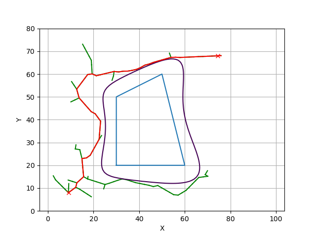

# CBF-RRTstar

1. Clone this repo and install the required libraries

```
git clone https://github.com/shaygong322/CBF-RRTstar.git
```

```
conda env create -f requirements/environment.yml
```


2. Sampling equidistant n points on the map and labeled each point either free space or obstacle

  + obstacles points:

  ```python
  points1 = [[5, 71], [18, 74], [21, 64], [7, 62]]
  points2 = [[15, 40], [25, 47], [25, 38]]
  points3 = [[49, 46], [51, 56], [60, 54], [57, 45]]
  points4 = [[88, 32], [93, 35], [94, 30]]
  points5 = [[50, 17], [56, 20], [57, 16], [52, 14]]
  obs_list = [points1, points2, points3, points4, points5]
  ```

  + safe distance to create a buffer zone around obstacles: `sd = 4`

  + draw the grid map and obstacles: `draw_poly(obs_list, sd)`


3. Using logistic regression to construct polynomial barrier functions to represent complex obstacles

  + Somehow the functions in the existing package do not look good on the simulation result, so we write our own sigmoid, regularized loss function, and the gradient.
  + Constructing polynomial barrier function h(x) and draw the contour to represent the obstacles.
  + Problems & future work: 
    + If the obstacles are too small, then the obstacle/free space ratio is too small, causing the simulating of polygons being affected.
    + There are other points (mostly outside the map) that satisfy $$\beta z^T = 0$$ so as shown in the [figure](#image-anchor), there will be dots and lines other than just the obstacles.
    + Other problems such as local minima due to there may be indentation of some edges of the polygons.

<a name="image-anchor"></a>


4. CBF-RRT

+ Instead of using `steer` and `check_collision` to find the new_node and determine whether to add into the node_list, we use `cbf_rrt_steer` .

+ `cbf_rrt_steer`: it's a 4-step steering controller, for every new node, we construct a QP to steer it away from the obstacle.

  + `barrier_function(each, x1, x2)` `barrier_function_derivative(each, x1, x2, theta, v)` `barrier_function_second_derivative(each, x1, x2, theta, v)`

  + CBF constraint:

    + $\ddot{b}(x,u) = B_{ddot_c} + B_{ddot_w}w$  where $B_{ddot_c}$ is autonomous part, $B_{ddot_w}$ is relevant to control input $w$ 

    + $B_{ddot_c} + B_{ddot_w}w + k_2\dot{h}(x) + k_1h(x) \geq 0$

      which means $-B_{ddot_w}w \geq B_{ddot_c} + k_2\dot{h}(x) + k_1h(x)$

    + QP:

      $\begin{aligned}
      \text{minimize} \quad & \frac{1}{2}w^2 \\
      \text{subject to} \quad & -B_{ddot_w}w \geq B_{ddot_c} + k_2\dot{h}(x) + k_1h(x) \\
      & -1.05 \leq w \leq 1.05
      \end{aligned}$
  
  too much math part I'll just skip


